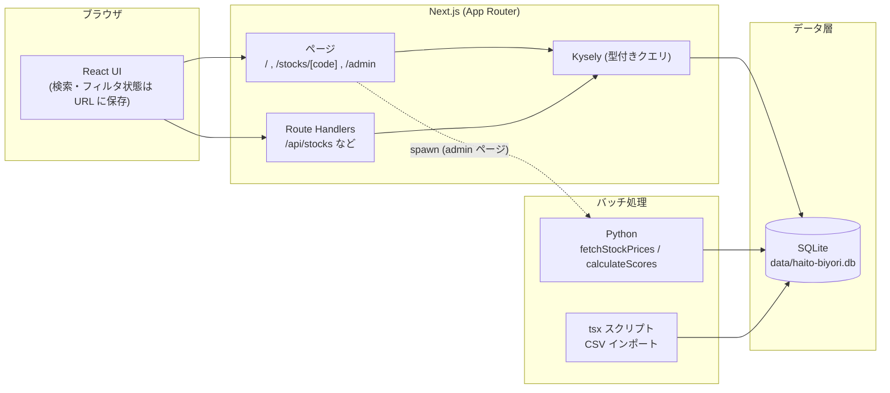

# アーキテクチャドキュメント

配当びより (Haito Biyori) の開発者向けドキュメント。
システム構成・設計判断・開発手順をまとめる。

ユーザー向けの概要とセットアップ手順は [README](../README.md) を参照。

## 全体構成



- **アプリ本体**: Next.js。DB アクセスはすべてサーバー側 (Server Components / Route Handlers) で行い、`better-sqlite3` + Kysely で SQLite に接続する
- **データ収集・スコア計算**: Python バッチ。標準ライブラリ `sqlite3` で同じ DB ファイルに直接アクセスする
- **初期データ投入**: `tsx` で書かれた CSV インポートスクリプト

## ディレクトリ構成

```
├── db/
│   └── schema.sql            # SQLite スキーマ定義 (起動時に自動適用)
├── data/
│   ├── haito-biyori.db       # SQLite 本体 (gitignore)
│   └── *.csv                 # インポート用 CSV
├── src/
│   ├── app/                  # ページと API (App Router)
│   │   ├── page.tsx          # 一覧 (canonical 設定) → 実体は components/HomePage.tsx
│   │   ├── stocks/[code]/    # 銘柄詳細
│   │   ├── portfolio/        # ポートフォリオ (保有予定銘柄の調整)
│   │   ├── admin/            # 管理者ページ (バッチ実行)
│   │   ├── api/              # Route Handlers
│   │   ├── error.tsx         # エラーページ
│   │   └── not-found.tsx     # 404 ページ
│   ├── components/           # UI コンポーネント (ui/ は shadcn 生成物)
│   ├── constants/            # 定数 (ドメイン別に分割)
│   ├── hooks/
│   │   └── use-search-params.ts  # クエリパラメータの型付きフック
│   ├── lib/
│   │   ├── db.ts             # DB 接続 (better-sqlite3 + Kysely)
│   │   ├── api.ts            # データ取得関数 (サーバー専用)
│   │   └── stockListParams.ts # クエリパラメータの中央スキーマ
│   └── types/
│       └── db.ts             # DB の型定義 (kysely-codegen で自動生成)
├── scripts/                  # CSV インポートスクリプト (tsx)
├── python/                   # データ収集・スコア計算バッチ
└── docs/                     # このドキュメント
```

## データベース

### 接続 ([src/lib/db.ts](../src/lib/db.ts))

- DB ファイル: `data/haito-biyori.db` (環境変数 `SQLITE_DB_PATH` で変更可)
- 起動時に [db/schema.sql](../db/schema.sql) を適用する。スキーマは `create table if not exists` / `insert or ignore` のみで構成されているため、毎回適用しても安全 (初回起動で自動的に DB が作られる)
- エクスポートは2つ:
  - `db` — Kysely インスタンス。アプリからのクエリはこちらを使う
  - `sqlite` — better-sqlite3 の生接続。スクリプトなど生 SQL を使う場面用
- **カスタム SQL 関数 `normalize_search`** を接続時に登録している (後述の検索で使用)

### テーブルとビュー

| 種類     | 名前                      | 内容                                                                                               |
| -------- | ------------------------- | -------------------------------------------------------------------------------------------------- |
| テーブル | `markets` / `industries`  | 市場・業種マスタ (スキーマ内でシード投入)                                                          |
| テーブル | `stocks`                  | 銘柄 (コード・名前・株価・配当利回り)。`is_excluded = 1` で対象外 (上場廃止など。削除はしない方針) |
| テーブル | `financial_history`       | 決算データ (銘柄×年×月でユニーク)                                                                  |
| テーブル | `scores`                  | スコア (8項目 + 合計。銘柄ごとに1行)                                                               |
| テーブル | `portfolio_items`         | ポートフォリオの保有予定銘柄 (コード + 株数)                                                       |
| ビュー   | `stocks_with_total_score` | 一覧用 (stocks + マスタ + 合計スコア)                                                              |
| ビュー   | `stocks_with_scores`      | 詳細・CSV用 (stocks + マスタ + 全スコア)                                                           |

- ビューは `inner join scores` のため、**scores 行がない銘柄は表示されない** (仕様)
- ビューは `is_excluded = 0` で絞るため、**対象外フラグの銘柄も表示されない**。Python の銘柄取得 (`fetch_stocks_from_db` など) も同様に除外する
- stocks の `updated_at` 自動更新トリガーは **price / dividend_yield の更新時のみ発火** (is_excluded などの管理用カラムの変更では株価更新日時を変えない)
- `updated_at` はトリガーで自動更新

### 型定義の自動生成 (kysely-codegen)

```bash
npm run db:codegen   # 実DBから src/types/db.ts を再生成
```

- 設定は [.kysely-codegenrc.json](../.kysely-codegenrc.json)
- SQLite の PRAGMA は主キーやビューの列を nullable と誤報告するため、実際には非null のカラムを `overrides.columns` で上書きしている
- **スキーマを変更したら必ず再生成すること**。ビュー定義を変えた場合は overrides の見直しも必要

### スキーマ変更の手順

1. [db/schema.sql](../db/schema.sql) を編集 (新規テーブル/ビューは `if not exists` で書く)
2. 既存 DB への反映は `sqlite3 data/haito-biyori.db` で ALTER を手動実行
   (新規作成分は次回起動時に自動適用される)
3. `npm run db:codegen` で型を再生成
4. 必要なら Python 側 (`python/*.py`) のクエリも更新

## クエリパラメータ設計 (一覧ページ)

一覧ページの状態 (検索・フィルタ・ページネーション) は**すべて URL クエリパラメータに保存**する。
中央スキーマは [src/lib/stockListParams.ts](../src/lib/stockListParams.ts)。

| 論理名   | URLキー | 型                      | デフォルト                |
| -------- | ------- | ----------------------- | ------------------------- |
| search   | `q`     | string                  | ""                        |
| market   | `m`     | number[] (カンマ区切り) | []                        |
| industry | `i`     | number[] (カンマ区切り) | []                        |
| yield    | `y`     | number                  | **3.5** (%以上で絞り込み) |
| score    | `s`     | number                  | 0 (=全て)                 |
| page     | `p`     | number                  | 1                         |
| rows     | `r`     | number                  | 10                        |

設計のポイント:

- **nuqs のパーサーで型付き**。不正な値 (`p=abc` など) はデフォルト値に落ちる
- **デフォルト値と同じ値は URL から省略**される
- クライアントは `useStockListParams()` ([src/hooks/use-search-params.ts](../src/hooks/use-search-params.ts))、
  API ルートは `loadStockListParams()` で同じスキーマを共有する
- **正規化**: `normalizeStockListQuery()` が「キーをスキーマ定義順に並べ替え / 旧形式のフル名キー (`search=` など) を短縮キーに変換 / 不正値・デフォルト値を除去」する。
  一覧ページ ([HomePage.tsx](../src/components/HomePage.tsx)) がアドレスバーの URL を常にこの正規形に `replaceState` で書き換える
- **SEO**: 同条件で URL 文字列が常に一致するよう、canonical URL も同じ serializer で生成する
  (一覧は正規化したクエリ付き、詳細はクエリなしの `/stocks/{code}` に固定)。
  canonical の解決基準は `NEXT_PUBLIC_SITE_URL` (未設定時は localhost)

## 検索の仕組み

検索は SQL の LIKE で行うが、表記ゆれを吸収するため**入力とカラムの両方を同じ正規化関数に通して比較**する。

- 正規化 (`normalizeSearchText` in [db.ts](../src/lib/db.ts)):
  1. NFKC 正規化 (全角英数字→半角、半角カナ→全角)
  2. 小文字化
  3. カタカナ→ひらがな畳み込み (`ァ`〜`ヶ` から 0x60 を引く)
- 同じ関数を SQL から呼べるよう、better-sqlite3 のカスタム関数 `normalize_search` として登録
- クエリ側: 空白区切りの各単語が code または name に部分一致すればヒット (AND 条件)。
  LIKE のワイルドカード (`%` `_`) は `escape '\'` 句でエスケープ

これにより「cross → Ｃｒｏｓｓ」「おーびっく → オービック」「ｵｰﾋﾞｯｸ → オービック」などがヒットする。

> 注意: `normalize_search` は Next.js プロセス内で登録される関数のため、
> `sqlite3` CLI や Python から同じクエリは実行できない (現状 Python は検索を使わないため影響なし)。

## API エンドポイント

| エンドポイント                             | 用途                                                                          |
| ------------------------------------------ | ----------------------------------------------------------------------------- |
| `GET /api/stocks`                          | 一覧 (フィルタ・ページネーション対応)                                         |
| `GET /api/stocks/export`                   | CSV エクスポート用の全件取得 (1000件ずつ内部ページング)                       |
| `GET /api/markets` / `GET /api/industries` | マスタ取得                                                                    |
| `GET /api/portfolio`                       | ポートフォリオ一覧 (銘柄情報と結合済み)                                       |
| `POST /api/portfolio`                      | ポートフォリオに銘柄を追加 (body: `{ code }` または一括の `{ codes: [...] }`) |
| `PATCH /api/portfolio/[code]`              | 株数を更新 (body: `{ shares }`)                                               |
| `DELETE /api/portfolio/[code]`             | ポートフォリオから銘柄を削除                                                  |
| `DELETE /api/portfolio`                    | ポートフォリオの全銘柄を削除                                                  |
| `GET /api/exec/sync-stocks`                | 銘柄リスト同期バッチの実行 (admin用・ストリーミング)                          |
| `GET /api/exec/fetch-stocks`               | 株価取得バッチの実行 (admin用・ストリーミング)                                |
| `GET /api/exec/calc-scores`                | スコア計算バッチの実行 (admin用・ストリーミング)                              |

クエリパラメータは一覧ページと同じ短縮キー (`q` `m` `i` `y` `s` `p` `r`)。

## データパイプライン

### 初期データ投入 (CSV → SQLite)

```bash
npx tsx scripts/import_stocks.ts             # data/stocks.csv → stocks
npx tsx scripts/import_financial_history.ts  # data/financial_history.csv → financial_history
npx tsx scripts/update_operating_profit.ts   # data/operating_profit.csv → 営業利益の更新
```

> 注意: `data/financial_history.csv` のヘッダーは `period` だが、インポートスクリプトは `month` 列を期待している。CSV を用意する際はヘッダーを `month` にすること。

### Python バッチ

リポジトリルートから実行する (ログパスがルート基準のため):

```bash
python/venv/bin/python python/syncStockList.py      # JPX の上場銘柄一覧と同期 (新規上場/上場廃止/社名・市場変更)
python/venv/bin/python python/fetchStockPrices.py   # yfinance で株価・配当利回りを取得し stocks を更新
python/venv/bin/python python/calculateScores.py    # financial_history からスコアを算出し scores を upsert
```

### 銘柄リストの同期 (syncStockList.py)

[JPX が公開する上場銘柄一覧](https://www.jpx.co.jp/markets/statistics-equities/misc/tvdivq0000001vg2-att/data_j.xls) (月次更新の Excel) と DB を突き合わせ、
新規上場の追加・上場廃止の `is_excluded = 1` 設定・社名/市場区分/業種の変更反映を行う。

- 対象は**東証の内国株式の普通株のみ** (ETF・REIT・PRO Market・外国株、および5桁コードの優先株・社債型種類株式は除外)
- 名証・札証・福証の銘柄は JPX データに含まれないため**同期対象外** (差分判定も東証銘柄に限定している)
- `--dry-run` で DB を更新せず差分だけ確認できる (admin ページの「確認のみ」チェックボックスも同じ)
- 上場廃止銘柄は**削除せず対象外フラグを立てる**だけなので、過去の決算データやスコアは残る

- yfinance のティッカーは **市場に応じてサフィックスを切り替える** (`MARKET_SUFFIXES` in [fetchStockPrices.py](../python/fetchStockPrices.py))。
  東証 `.T` / 名証 `.N` / 札証 `.S` / 福証 `.F` (市場が未設定・不明なら `.T`)。
  なお名証銘柄は現時点で `.N` でもデータを取得できない (Yahoo Finance 側の未対応と見られる) が、
  売買可能な銘柄のため対象外フラグは立てず、取得失敗として扱う
- `fetchStockPrices.py --updated-before YYYY-MM-DD`: その日より前に更新された銘柄だけを対象にする。
  途中で中断 (PCスリープ等) した更新を残りの銘柄だけで再開できる。
  admin ページの「未更新の銘柄のみ」チェックボックスからも同じ機能を使える
  (`?resume=1` を送り、サーバー側で「今日」に解決して `--updated-before` に変換する。
  `?updatedBefore=YYYY-MM-DD` で日付を明示指定することも可能)
- 長時間の実行はスリープ抑止付きで行うとよい: `caffeinate -i python/venv/bin/python python/fetchStockPrices.py`

- DB パスは `SQLITE_DB_PATH` または `<リポジトリ>/data/haito-biyori.db` (スクリプトの位置から解決)
- ログは `python/logs/` に出力
- **admin ページ (`/admin`) からも実行可能**。[python-stream.ts](../src/lib/python-stream.ts) が venv の Python を spawn し、進捗を JSON でストリーミングする

### スコアリング

8つの評価項目 (売上・営業利益率・EPS・営業CF・一株配当・配当性向・自己資本比率・現金等) を各5点で採点し、合計 (満点40) を `scores.total` に保存する。
ロジックは [python/calculateScores.py](../python/calculateScores.py) (CAGR・回帰の R²・減少回数などで判定)。

## フロントエンドの設計メモ

- **一覧ページ** — `app/page.tsx` はサーバーコンポーネント (canonical 生成のため)。実体はクライアントの `HomePage.tsx` で、URL の変更を監視して `/api/stocks` をフェッチする。検索はデバウンス付きインクリメンタル (`SEARCH_DEBOUNCE_MS`)
- **詳細ページ** — 一覧から遷移する際にクエリ文字列を引き継ぎ、「一覧に戻る」で検索条件ごと復元する (`router.back()` ではなく URL ベースなので新しいタブやリロードでも壊れない)
- **ポートフォリオ** — 保有予定銘柄は DB (`portfolio_items`) に永続化。一覧の各行の「＋」ボタン・「表示中を全て追加」ボタン・詳細ページのボタンで追加/削除でき、一覧での登録状態は `PortfolioProvider` (React Context) が一括保持する。`/portfolio` ページで株数を1株単位で調整し、購入金額・年間配当 (税引前)・PF利回り (加重平均)・業種数を現在値ベースで自動計算する。業種分散は構成比順の横バーで表示し、1業種が `INDUSTRY_CONCENTRATION_WARNING_RATIO` (25%) を超えると警告を出す
- **レスポンシブ方針**:
  - テーブルは TanStack Table の `meta.className` で列を出し分け (`hidden sm:table-cell` など)。
    常時表示は「企業名 (コード・モバイルでは市場/業種バッジ付き)・配当利回り・スコア」
  - フィルタは「絞り込み」ボタン1つに集約 (サブメニュー式ドロップダウン)
  - ヘッダーのナビは sm 未満でハンバーガーメニューに畳む
  - チャートは全体を横スクロール可能にし (`min-w` + `overflow-x-auto`)、タブは sm 未満で全幅3等分
  - body は `min-h-dvh` (モバイルのアドレスバー分のスクロールを防ぐ)
- **エラー/404** — `error.tsx` の復帰リンクは `<a>` によるフルリロード (エラー境界の状態を確実に破棄するため)。404 はカスタム `not-found.tsx`

## 開発コマンド一覧

```bash
npm run dev          # 開発サーバー
npm run build        # 本番ビルド
npm run start        # 本番サーバー
npm run lint         # ESLint
npm run db:codegen   # DB 型定義の再生成 (スキーマ変更時)
npx tsc --noEmit     # 型チェック
```
